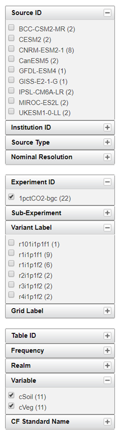

## Download data
I used uk [database](https://esgf-index1.ceda.ac.uk/search/cmip5-ceda/) <br />
All raw data and code are available [HERE](https://esgf-index1.ceda.ac.uk/search/cmip5-ceda/)<br />
code and output file available [HERE](CMIP5_code_csv.zip) <br />
This is what I search for: <br />

```{r pressure1, echo=FALSE, fig.cap="CMIP6"}

```
```{r pressure2, echo=FALSE, fig.cap="CMIP5"}
knitr::include_graphics("CMIP5.png")
```


## from map to global sum
Every model is different from each other in resolution...

|              | lon | lat | unit  |   |
|--------------|-----|-----|-------|---|
| CESM1-BGC    | 288 | 192 | kg/m2 |   |
| CanESM2      | 128 | 64  | kg/m2 |   |
| GFDL-ESM2M   | 144 | 90  | kg/m2 |   |
| HadGEM2-ES   | 192 | 145 | kg/m2 |   |
| IPSL-CM5A-LR | 96  | 96  | kg/m2 |   |
| MPI-ESM-LR   | 192 | 96  | kg/m2 |   |
| NorESM1-ME   | 144 | 96  | kg/m2 |   |

Then, run **CMIP5.m**, which do unit conversion and grid size calculation
Copy yearly output into **For_CESAR.csv**

## Calculate delta Cveg and Csoil

This part is particular annoying because Some of the model started from 1850, some from 1860, some from 0001,
so I tried to calculate their CO2 output, however, only four models reported CO2 concentration under experiment esmFixClim1.
This is done with **CMIP5_co2.m**, However, I found that GFDL-ESM2M did not increase by 1% per year, it increased too slowly, and CESM1-BGC is even decreasing
    whatever, lets assume first year is 285ppm, so 372ppm should be
    year 28. amd 616ppm should be year 78 (well, if they do increase by 1% every year )

The use **DIfference_b_372_616.m** to compute the difference between year 78 and year 28

